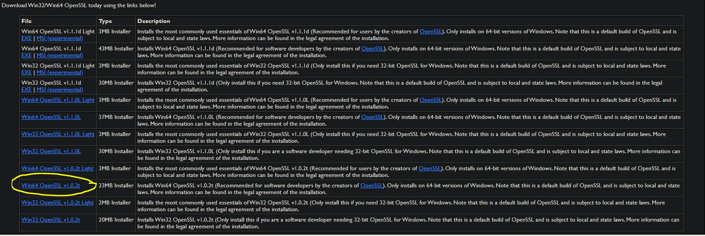

# Encrypted Database Management

This program manages an encrypted database using SQLiteCpp and sqlicipher. In the second part of the README is explained how to prepare the system.

## Usage

Now it is possible to use SQLiteCpp and SQLCipher combined together. Set the platform to x64.
In the new project add the following dependencies:
- Configuration Properties -> C/C++ -> Additional Include Directories = `"C:\Libs\SQLiteCpp-master\include"`  
- Configuration Properties -> Linker -> General -> Additional Library Directories = `"C:\Libs\SQLiteCpp-master\build\x64\Debug"` (Change Debug to Release if in Release mode)
- Configuration Properties -> Linker -> Input -> Additional Dependencies = `sqlite3.lib;SQLiteCpp.lib;"C:\Libs\OpenSSL-Win64\lib\libeay32.lib";`

The APIs are now the same as the standard SQLiteCpp with the possibiliy to use db->key(password) to decrypt the db and db->rekey(password) to encrypt it.
Remember that whenever a new database is created it is not encrypted and its default passowrd is an empty string, when changing the password to a non-empty string you are actually encrypting the db.

## databaseManagerTest.cpp
This is the main of this project and it can be used to test whether the compilation completed succesfully.  
When launching it, a database called `testdb.db` is created and filled with a table called `table1`. Then two threads are created and launched: one fills the database with random names and descriptors and one reads from `table1` and prints the results. After 10 seconds the program gets automatically closed.  
If the `testdb.db` already exists and it is not encrypted, a new encrypted database called `testdb1.db` is created and all the data from `testdb.db` are cloned inside `testdb1.db`. Eventually, `testdb.db` is deleted and `testdb1.db` becomes the main database.

In order to check whether the database has been encrypted it is possible to use [sqlitebrowser](https://sqlitebrowser.org/).

# Build SQLiteCpp and SQLCipher together
## Requirements
* [SQLiteCpp v2.4.0](https://github.com/SRombauts/SQLiteCpp)
* [sqlcipher v3.4.2](https://github.com/sqlcipher/sqlcipher)
* [OpenSSL v1.0.2t](https://slproweb.com/products/Win32OpenSSL.html)
* [TCL v8.5.18](https://www.activestate.com/products/activetcl/downloads/)
* Visual Studio 2017 (with 2015 build tools)
* CMake

## Compiling

**OpenSSL**  

Download version 1.0.2t from the link and install. The installation path should be `C:\Libs\` but it can be changed as long as the file `Makefile.msc` from SQLCipher installation folder is correctly updated. Append `C:\Libs\OpenSSL-Win64` to the system's environmental variables.  
The file to be downloaded is:  


**TCL**  

Download and install version 8.5.18 and install. The download requires to register, but it's free. Append `C:\Tcl\bin` to the system's environmental variables.

**SQLCipher**  
- Download version 3.4.2 of SQLCipher from github. 

- Create a folder `build` and copy the makefile `Makefile.msc` from `C:\...\encrypted-database-management\sqlcipher_license_and_makefile\` to the new build folder `C:\Libs\...\sqlcipher-3.4.2\build`.  
This makefile is equal to the file from the sqlcipher github repository except for some small adjustments taken from [here](https://github.com/sqlitebrowser/sqlitebrowser/wiki/Win64-setup-%E2%80%94-Compiling-SQLCipher) and from many many compilation attempts.

- Now open the Visual Studio 2015 Developer Command Prompt and launch  
```
call "C:\Program Files (x86)\Microsoft Visual Studio 14.0\VC\vcvarsall.bat" x64
```
in order to initialize the console variables.

- cd to the build directory   
```
cd C:\Libs\...\sqlcipher-3.4.2\build
```

- Launch the following commands  
```
nmake /f Makefile.msc TOP=..\  
nmake /f Makefile.msc sqlite3.c TOP=..\  
nmake /f Makefile.msc sqlite3.dll TOP=..\  
nmake /f Makefile.msc sqlite3.exe TOP=..\  
nmake /f Makefile.msc test TOP=..\  
```
At the end of this process, you will have a sqlite3.lib and many other files inside the build folder. The only purpose of this first part was to update 3 files (`sqlit3.c`, `sqlite3.h` and `shell.c`) that will be used in the next step.

**SQLiteCpp**

Download SQLiteCpp from github. It will contain a folder called `sqlite3\` and a CMakeList among other files.  

- Copy the 3 aforementioned files (`sqlit3.c`, `sqlite3.h` and `shell.c`) from `C:\Libs\...\sqlcipher-3.4.2\build\` to `C:\Libs\SQLiteCpp-master\sqlite3\`

- Open CMake, set as source code path `C:/Libs/SQLiteCpp-master` and as build path `C:/Libs/SQLiteCpp-master/build`, configure and generate.

- Now, inside the build folder there will be a Visual Studio solution called `SQLiteCpp.sln`. Open the solution using either Visual Studio 2017 with the 2015 toolset (v140) or Visual Studio 2015. Select `x64` as platform.

- Right click onto `sqlite3` project in the solution explorer and choose properties.  
--  Configuration Properties -> General -> Platform Toolset = Visual Studio 2015 (v140)  
--  Configuration Properties -> C/C++ -> Additional Include Directories = `C:\Libs\SQLiteCpp-master\include;C:\Libs\OpenSSL-Win64\include;C:\Libs\SQLiteCpp-master\sqlite3;%(AdditionalIncludeDirectories)`  
-- Configuration Properties -> Librarian -> Target Machine = MachineX64 (/MACHINE:X64)

- Right click onto `sqlite3` project in the solution explorer and choose properties  
--  Configuration Properties -> C/C++ -> Additional Include Directories = `C:\Libs\SQLiteCpp-master\include;C:\Libs\SQLiteCpp-master\sqlite3;%(AdditionalIncludeDirectories)`  
--  Configuration Properties -> Librarian -> Target Machine = MachineX64 (/MACHINE:X64)  

- Build the projects sqlite3, SQLiteCpp and ALL_BUILD in both Debug and Releas.


### Other links
sqlcipher API https://www.zetetic.net/sqlcipher/sqlcipher-api/ 

sqlitecpp functions http://fossil.twicetwo.com/index.pl/epic-quest-land/artifact/41105b83e76bdd5e 

lib problem solution http://thebugfreeblog.blogspot.com/2012/08/compiling-sqlcipher-for-windows.html 

### TODO
- [x] Implement non-encrypted -> encrypted
- [ ] Implement a simple console interface in order to insert the db name and choose whether to use an encrypted database or not.
- [ ] Implement encrypted -> non-encrypted

